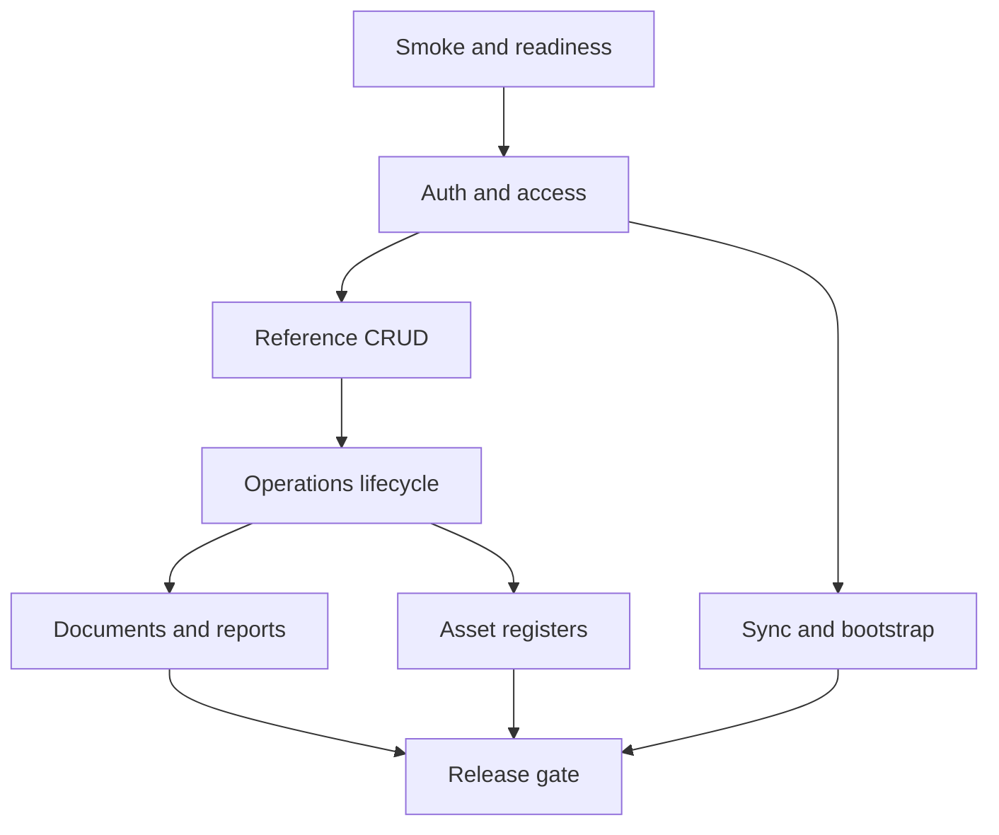

# Pre-prod test plan for SyncServer API

## 1. Цель плана

Подготовить полный pre-prod план тестирования для всего API-проекта [`SyncServer`](../README.md) перед выкладкой в production, с отдельным усиленным блоком для CRUD, прав доступа и сквозных бизнес-потоков.

План опирается на:
- состав смонтированных роутеров в [`create_app()`](../main.py:31)
- инвентарь API в [`docs/ENDPOINT_INVENTORY.md`](../docs/ENDPOINT_INVENTORY.md)
- архитектурные ограничения в [`ARCHITECTURE.md`](../ARCHITECTURE.md)
- модель предметной области в [`DOMAIN_MODEL.md`](../DOMAIN_MODEL.md)
- текущий набор тестов в каталоге [`tests/`](../tests)

Этот документ описывает только план, объём и порядок тестирования. Реализация тестов в него не входит.

## 2. Что должно быть подтверждено перед production

- API поднимается и публикует весь заявленный контур из [`create_app()`](../main.py:31)
- аутентификация через `X-User-Token` и `X-Device-Token` работает корректно
- ролевая и site-scoped авторизация соответствует текущей логике в [`app/core/identity.py`](../app/core/identity.py) и [`app/services/operations_policy.py`](../app/services/operations_policy.py)
- все CRUD-поверхности не ломают инварианты данных
- операции, документы, asset registers и read-модели согласованы между собой
- при старте приложения автоматическая подготовка БД не ломает развёртывание через [`ensure_database_ready()`](../app/core/migrations.py:178) и вызов в [`main.py`](../main.py:40)
- ошибки возвращаются в ожидаемом формате через обработчик [`sync_server_exception_handler()`](../main.py:71)
- middleware запроса стабильно проставляет `X-Request-Id` через [`request_context_middleware()`](../main.py:57)

## 3. Краткий анализ текущего покрытия

### 3.1 Уже видимое покрытие

По существующим файлам в [`tests/`](../tests) уже видно покрытие следующих зон:

- auth basics: [`tests/test_auth_routes.py`](../tests/test_auth_routes.py), [`tests/test_auth_unified.py`](../tests/test_auth_unified.py)
- operations and permissions: [`tests/test_operations_permissions.py`](../tests/test_operations_permissions.py), [`tests/test_operations_effective_at_api.py`](../tests/test_operations_effective_at_api.py), [`tests/test_operations_acceptance_and_issue_api.py`](../tests/test_operations_acceptance_and_issue_api.py), [`tests/test_operations_service_cancel.py`](../tests/test_operations_service_cancel.py), [`tests/test_operations_workflow_policy.py`](../tests/test_operations_workflow_policy.py)
- documents: [`tests/test_document_models.py`](../tests/test_document_models.py), [`tests/test_document_service.py`](../tests/test_document_service.py), [`tests/test_documents_repo.py`](../tests/test_documents_repo.py), [`tests/test_documents_routes.py`](../tests/test_documents_routes.py)
- health: [`tests/test_health_endpoints.py`](../tests/test_health_endpoints.py), [`tests/test_health_service.py`](../tests/test_health_service.py)
- sync: [`tests/test_http_sync.py`](../tests/test_http_sync.py)
- catalog partial coverage: [`tests/test_catalog_read_model.py`](../tests/test_catalog_read_model.py), [`tests/test_catalog_admin_soft_delete.py`](../tests/test_catalog_admin_soft_delete.py), [`tests/test_catalog_uncategorized.py`](../tests/test_catalog_uncategorized.py), [`tests/test_catalog_csv_import.py`](../tests/test_catalog_csv_import.py)
- balances and reports partial read coverage: [`tests/test_balances_read_model.py`](../tests/test_balances_read_model.py), [`tests/test_reports_read_model.py`](../tests/test_reports_read_model.py)
- admin user and device flow partial coverage: [`tests/test_user_admin_flow.py`](../tests/test_user_admin_flow.py)
- identity and access rules: [`tests/test_access_service_business_access.py`](../tests/test_access_service_business_access.py), [`tests/test_identity_business_access.py`](../tests/test_identity_business_access.py)

### 3.2 Зоны вероятного недопокрытия перед production

По сопоставлению [`docs/ENDPOINT_INVENTORY.md`](../docs/ENDPOINT_INVENTORY.md) с текущими файлами тестов в [`tests/`](../tests) нужно отдельно проверить и, при необходимости, усилить:

- API recipients целиком
- API admin sites
- API admin access scopes
- эндпоинты [`/api/v1/auth/sites`](../docs/ENDPOINT_INVENTORY.md) и [`/api/v1/auth/context`](../docs/ENDPOINT_INVENTORY.md)
- рендер документов в HTML и PDF через [`app/api/routes_documents.py`](../app/api/routes_documents.py)
- [`/api/v1/balances/by-site`](../docs/ENDPOINT_INVENTORY.md) и [`/api/v1/balances/summary`](../docs/ENDPOINT_INVENTORY.md)
- фильтры и пагинацию для pending acceptance, lost assets и issued assets
- матрицу прав на catalog admin list/get/delete операции
- запуск приложения с миграциями и поведение на пустой и на уже заполненной БД
- единый формат ошибок и `X-Request-Id`

Эти зоны надо считать обязательными в pre-prod регрессе, даже если часть функционала косвенно уже покрыта.

## 4. Release-critical приоритеты

### P0 — блокирующие для production

- auth и token validation
- роли `root`, `chief_storekeeper`, `storekeeper`, `observer`
- site-scoped access: `can_view`, `can_operate`, `can_manage_catalog`
- CRUD для admin users, admin devices, catalog admin units/categories/items, recipients
- жизненный цикл operations
- согласованность balances, pending acceptance, lost assets, issued assets
- documents generate, read, list, status update, render
- health and readiness
- startup migrations

### P1 — важные до релиза

- admin sites
- admin access scopes
- reports read model
- auth context payload correctness
- sync bootstrap, ping, push, pull
- фильтрация, пагинация и обработка пустых выборок во всех list endpoint

### P2 — расширенный регресс

- негативные сценарии сериализации и пограничные payload cases
- визуальная валидация HTML/PDF документов
- проверки стабильности на повторных запросах и повторном старте сервиса

## 5. Критерии входа в pre-prod тестирование

- версия схемы БД доведена до актуального `head`
- состав роутеров зафиксирован согласно [`create_app()`](../main.py:31)
- подготовлены тестовые токены для всех ролей
- подготовлены минимум 2 сайта для cross-site сценариев
- подготовлен набор активных и неактивных сущностей для negative cases
- зафиксирован актуальный инвентарь endpoint в [`docs/ENDPOINT_INVENTORY.md`](../docs/ENDPOINT_INVENTORY.md)
- согласован список поддерживаемых operation types из текущего backend-кода

## 6. Критерии выхода из pre-prod тестирования

- нет блокирующих дефектов по P0
- нет открытых дефектов, нарушающих инварианты учёта и авторизации
- каждая CRUD-поверхность проверена по позитивным, негативным и permission сценариям
- каждая read-only поверхность проверена на права доступа, фильтры и пустые ответы
- минимум один полный сквозной сценарий проходит для каждого критичного бизнес-потока
- результаты сверены между API-ответами и состоянием БД для критичных сущностей
- вручную подтверждены HTML и PDF документы

## 7. Тестовая среда и данные

### 7.1 Обязательная конфигурация среды

- отдельная pre-prod БД PostgreSQL
- прогон на пустой БД
- прогон на БД после применения всех миграций
- прогон на БД с данными, близкими к реальному объёму интеграционного стенда
- включённые startup migrations, потому что они вызываются из [`main.py`](../main.py:40)

### 7.2 Обязательный набор тестовых ролей

| Актор | Назначение |
| --- | --- |
| root | глобальные admin и bootstrap сценарии |
| chief_storekeeper | глобальный business-supervisor контур |
| storekeeper site A | рабочие CRUD и operations сценарии в пределах одного сайта |
| storekeeper site B | проверка межсайтовых ограничений |
| observer site A | read-only проверки |
| deactivated user | проверка отказов аутентификации |
| active device | sync сценарии |
| deactivated device | negative sync сценарии |

### 7.3 Обязательный набор данных

- минимум 2 сайта
- минимум 2 unit
- дерево categories с глубиной не менее 3 уровней
- несколько item, включая активные и неактивные
- пользователи с разными ролями и scope
- recipients разных типов
- операции разных типов, включая сценарии с draft, submitted, cancelled, accepted
- документы минимум двух типов и в разных статусах
- lost assets, pending acceptance и issued assets для read-model и resolve сценариев

## 8. Базовая стратегия прогона

## 9. Усиленный CRUD-блок

Ниже перечислены сущности и обязательные проверки по CRUD. Для каждого блока должны быть покрыты минимум следующие классы сценариев:

- позитивный happy path
- валидация обязательных полей
- некорректные типы и бизнес-значения
- доступ без токена
- доступ с невалидным токеном
- доступ с корректным токеном, но без роли
- доступ с корректной ролью, но без site scope
- дубликаты и конфликты уникальности
- read-after-write
- list после create/update/delete
- поведение после deactivate или delete
- пагинация, фильтры, поиск и сортировка там, где они поддерживаются

### 9.1 CRUD-матрица

| Поверхность | C | R | U | D | Особые проверки |
| --- | --- | --- | --- | --- | --- |
| Admin Users | да | да | да | деактивация | root-only, rotate token, replace scopes |
| Admin Devices | да | да | да | да | token rotation, active or inactive state |
| Admin Sites | да | да | да | нет | root-only, visible in dependent modules |
| Admin Access Scopes | да | да | да | нет | root-only, duplicate site scope handling |
| Catalog Admin Units | да | да | да | да | soft delete semantics |
| Catalog Admin Categories | да | да | да | да | tree integrity, no cycles, reserved nodes |
| Catalog Admin Items | да | да | да | да | uncategorized fallback, inactive relations |
| Recipients | да | да | да | да | merge scenarios, duplicate recipient handling |
| Documents | generate | get or list | status update | нет | render html or pdf, access by site |
| Operations | create | list or get | draft update | cancel semantic | submit, accept-lines, effective-at |

## 10. Детальный план по модулям API

### 10.1 Health

Проверить endpoints из [`docs/ENDPOINT_INVENTORY.md`](../docs/ENDPOINT_INVENTORY.md):

- `GET /health`
- `GET /ready`
- `GET /health/detailed`
- `GET /health/readiness`
- `GET /health/liveness`

Проверки:
- статус-коды
- базовая структура payload
- корректная деградация при недоступности БД
- отсутствие утечки внутренних деталей в production-like ошибках

### 10.2 Auth

Проверить:

- `POST /auth/sync-user`
- `GET /auth/me`
- `GET /auth/sites`
- `GET /auth/context`

Сценарии:
- root-only ограничения на `sync-user`
- запрет создания или обновления root через `sync-user`
- корректный состав `available_sites`
- согласованность `role`, `is_root`, `default_site`, permission flags
- отсутствие доступа у деактивированного пользователя
- корректное поведение при передаче только device token, только user token и неверной комбинации токенов

### 10.3 Admin Roles

Проверить `GET /admin/roles`:

- доступ для root
- допустимость или недопустимость для business roles согласно фактическому контракту
- отсутствие дрейфа между API и каноническим списком ролей из [`app/api/admin_common.py`](../app/api/admin_common.py)

### 10.4 Admin Sites

Проверить:

- `GET /admin/sites`
- `POST /admin/sites`
- `PATCH /admin/sites/{site_id}`

Сценарии:
- create с валидным payload
- create с дубликатами `code` или `name`, если ограничения предусмотрены
- update активного сайта
- update в невалидное состояние
- использование нового или изменённого сайта в auth, catalog, operations и devices

### 10.5 Admin Users

Проверить:

- `GET /admin/users`
- `GET /admin/users/{user_id}`
- `POST /admin/users`
- `PATCH /admin/users/{user_id}`
- `DELETE /admin/users/{user_id}`
- `GET /admin/users/{user_id}/sync-state`
- `PUT /admin/users/{user_id}/scopes`
- `POST /admin/users/{user_id}/rotate-token`

Отдельно проверить:
- фильтры list endpoint
- невозможность управлять root через admin API
- невозможность деактивировать текущего root
- инвалидизацию старого токена после rotate
- немедленное влияние новых scope на доступ к sites и операциям

### 10.6 Admin Access Scopes

Проверить:

- `GET /admin/access/scopes`
- `POST /admin/access/scopes`
- `PATCH /admin/access/scopes/{scope_id}`

Отдельно проверить:
- комбинации `can_view`, `can_operate`, `can_manage_catalog`
- изменение scope сразу отражается в `auth/context`, `catalog`, `balances`, `operations`
- повторное создание scope для той же пары user-site обрабатывается предсказуемо

### 10.7 Admin Devices

Проверить:

- `GET /admin/devices`
- `GET /admin/devices/{device_id}`
- `POST /admin/devices`
- `PATCH /admin/devices/{device_id}`
- `DELETE /admin/devices/{device_id}`
- `POST /admin/devices/{device_id}/rotate-token`

Отдельно проверить:
- создание устройства на site
- влияние деактивации на `ping`, `push`, `pull`
- инвалидизацию старого device token после rotate
- корректность связи device-site-user logs в sync потоках

### 10.8 Catalog Read API

Проверить:

- `GET /catalog/items`
- `GET /catalog/categories`
- `GET /catalog/categories/tree`
- `GET /catalog/units`
- `GET /catalog/sites`
- `GET /catalog/read/items`
- `GET /catalog/read/categories`
- `GET /catalog/read/categories/{category_id}/items`
- `GET /catalog/read/categories/{category_id}/children`
- `GET /catalog/read/categories/{category_id}/parent-chain`

Сценарии:
- видимость только доступных сайтов
- корректность дерева категорий
- пагинация и фильтры
- исключение неактивных записей там, где это ожидается
- read consistency после catalog admin mutation

### 10.9 Catalog Admin API

Проверить полный CRUD для:

- units
- categories
- items

Отдельные сценарии:
- права `root` и `chief_storekeeper`
- запрет для `storekeeper` и `observer`
- обязательность `X-Site-Id` для `chief_storekeeper`, если это требуется фактической реализацией в [`app/api/routes_catalog_admin.py`](../app/api/routes_catalog_admin.py)
- soft delete поведение
- защита от циклов в дереве категорий
- reserved category и `__UNCATEGORIZED__`
- item с `null`, несуществующей, неактивной category

### 10.10 Recipients API

Проверить:

- `POST /recipients`
- `POST /recipients/merge`
- `GET /recipients/{recipient_id}`
- `PATCH /recipients/{recipient_id}`
- `DELETE /recipients/{recipient_id}`
- `GET /recipients`

Отдельно проверить:
- merge только для `chief_storekeeper` или `root`
- list filters, search, pagination
- soft delete или hard delete фактическую семантику
- влияние merge на `issued-assets` и связанные операции

### 10.11 Operations API

Проверить:

- `GET /operations`
- `GET /operations/{operation_id}`
- `POST /operations`
- `PATCH /operations/{operation_id}`
- `PATCH /operations/{operation_id}/effective-at`
- `POST /operations/{operation_id}/submit`
- `POST /operations/{operation_id}/cancel`
- `POST /operations/{operation_id}/accept-lines`

Критичные сценарии:
- create draft для всех поддерживаемых типов операций
- редактирование только draft и только разрешёнными пользователями
- submit только для разрешённых ролей
- cancel draft и submitted операций
- изменение `effective_at` только разрешёнными ролями
- accept-lines только на допустимом сайте и только разрешёнными акторами
- корректные сайд-эффекты на balances и asset registers

### 10.12 Balances API

Проверить:

- `GET /balances`
- `GET /balances/by-site`
- `GET /balances/summary`

Сценарии:
- чтение только в допустимой видимости сайтов
- корректность агрегатов после operations submit, cancel, accept и lost asset resolve
- пустые ответы
- фильтры и форматы чисел

### 10.13 Asset Register API

Проверить:

- `GET /pending-acceptance`
- `GET /lost-assets`
- `GET /lost-assets/{operation_line_id}`
- `POST /lost-assets/{operation_line_id}/resolve`
- `GET /issued-assets`

Сценарии:
- pending acceptance появляется после submit и исчезает после accept или cancel
- lost assets создаются при частичной приёмке
- resolve поддерживает все допустимые actions
- issued assets корректно меняются после issue и issue_return
- фильтры по site, operation, item, recipient, search и pagination

### 10.14 Documents API

Проверить:

- `POST /documents/generate`
- `GET /documents/{document_id}`
- `GET /documents/{document_id}/render?format=html`
- `GET /documents/{document_id}/render?format=pdf`
- `GET /documents`
- `PATCH /documents/{document_id}/status`
- `GET /documents/operations/{operation_id}/documents`
- `POST /documents/operations/{operation_id}/documents`

Критичные сценарии:
- генерация документа из валидной операции
- запрет генерации без доступа к сайту операции
- list filters по site, type, status, operation
- status transition rules
- HTML render: content-type, шаблон, наличие ключевых полей документа
- PDF render: content-type, download headers, не пустой бинарный ответ
- document shortcut endpoint генерирует документ повторяемо и предсказуемо
- рендер не меняет бизнес-состояние операций и остатков

### 10.15 Reports API

Проверить:

- `GET /reports/item-movement`
- `GET /reports/stock-summary`

Сценарии:
- права доступа по ролям и scope
- корректность агрегатов после серии операций
- корректные граничные даты периода
- пустые периоды и пустые datasets

### 10.16 Sync API

Проверить:

- `POST /ping`
- `POST /push`
- `POST /pull`
- `POST /bootstrap/sync`

Критичные сценарии:
- device auth и root auth разделены корректно
- bootstrap доступен только root
- идемпотентность или безопасная повторяемость `push`
- корректная выдача seq и payload в `pull`
- поведение для деактивированного device
- корректность синхронизации после catalog/admin изменений

## 11. Сквозные бизнес-сценарии

### 11.1 Сквозной сценарий приёмки

- создать operation receive
- submit от разрешённой роли
- убедиться, что запись появилась в pending acceptance
- выполнить accept-lines
- проверить исчезновение pending acceptance
- проверить корректное изменение balances
- при частичной приёмке проверить появление lost assets

### 11.2 Сквозной сценарий перемещения между сайтами

- создать move между site A и site B
- submit
- проверить видимость операции обеими сторонами согласно правам
- принять строки на destination site
- сверить balances на обоих сайтах

### 11.3 Сквозной сценарий lost assets resolve

- создать ситуацию частичной приёмки
- получить lost asset detail
- выполнить resolve каждым допустимым action
- сверить balances, lost-assets list и audit expectations

### 11.4 Сквозной сценарий выдачи и возврата

- issue актив на recipient
- проверить `issued-assets`
- выполнить issue return
- проверить уменьшение или обнуление `issued-assets`

### 11.5 Сквозной сценарий documents

- создать и submit operation
- сгенерировать document
- получить metadata
- получить HTML и PDF render
- изменить status
- убедиться, что документы корректно привязаны к operation

## 12. Матрица прав доступа

Для каждого endpoint из [`docs/ENDPOINT_INVENTORY.md`](../docs/ENDPOINT_INVENTORY.md) проверить минимум следующие комбинации:

| Проверка | root | chief_storekeeper | storekeeper with scope | observer with scope | actor without scope |
| --- | --- | --- | --- | --- | --- |
| Auth read endpoints | да | да | да | да | нет |
| Root admin endpoints | да | нет | нет | нет | нет |
| Catalog read | да | да | да | да | нет |
| Catalog admin | да | да | нет | нет | нет |
| Operations read | да | да | зависит от scope | зависит от scope | нет |
| Operations write | да | да | зависит от `can_operate` | нет | нет |
| Accept lines | да | да | зависит от target site | нет | нет |
| Lost assets resolve | да | да | нет, если политика не разрешает | нет | нет |
| Documents read | да | да | зависит от site access | зависит от site access | нет |
| Documents write | да | да | зависит от `can_operate` | нет | нет |
| Reports and balances | да | да | зависит от `can_view` | зависит от `can_view` | нет |

Отдельно проверить изменения прав после:

- deactivation пользователя
- replace scopes
- create or update access scope
- rotate token

## 13. Негативные и boundary сценарии

Обязательные классы негативных проверок:

- отсутствующий токен
- невалидный токен
- токен деактивированного пользователя или device
- обращение к чужому сайту
- обращение к несуществующему id
- дубли уникальных полей
- пустой payload там, где он не допускается
- некорректный enum
- отрицательные количества
- нулевая и слишком большая pagination
- update уже удалённой или неактивной сущности
- submit уже submitted операции
- cancel уже cancelled операции
- render документа с неподдерживаемым `format`

## 14. Проверки согласованности данных

Это отдельный обязательный блок перед production.

После каждого критичного сценария сверять:

- operation status
- operation lines
- balances
- pending acceptance
- lost assets
- issued assets
- документы по operation
- доступность сущности через list и get endpoints

Особенно важно подтвердить, что:

- balances не редактируются напрямую и корректно выводятся из operations, как описано в [`ARCHITECTURE.md`](../ARCHITECTURE.md)
- asset registers отражают промежуточные состояния, как описано в [`DOMAIN_MODEL.md`](../DOMAIN_MODEL.md)
- cancel и resolve не оставляют сиротских записей
- read models совпадают с бизнес-событиями после каждой мутации

## 15. Нефункциональные проверки перед релизом

### 15.1 Startup and migrations

- запуск сервиса на пустой БД
- запуск сервиса на БД, уже находящейся на `head`
- повторный старт без побочных эффектов
- отсутствие падения при автопрогоне миграций из [`main.py`](../main.py:40)

### 15.2 Error contract

- ошибки бизнес-уровня возвращаются в ожидаемой структуре из [`sync_server_exception_handler()`](../main.py:71)
- неожиданные ошибки не раскрывают внутренние детали
- во всех ответах присутствует `X-Request-Id`, который добавляется в [`request_context_middleware()`](../main.py:57)

### 15.3 Basic performance sanity

- list endpoints отрабатывают приемлемо на наполненной pre-prod БД
- крупные ответы с пагинацией не ломают сериализацию
- PDF render не вызывает таймаутов на типовых документах

## 16. Рекомендуемый порядок выполнения

- [ ] Подтвердить состав endpoint и зафиксировать релизный scope
- [ ] Подготовить pre-prod БД и тестовые данные для multi-site сценариев
- [ ] Выполнить smoke по health, readiness, startup migrations
- [ ] Выполнить auth и access regression
- [ ] Выполнить усиленный CRUD regression для admin и catalog поверхностей
- [ ] Выполнить recipients CRUD regression
- [ ] Выполнить operations regression по всем поддерживаемым типам
- [ ] Выполнить asset registers regression
- [ ] Выполнить documents regression, включая HTML и PDF render
- [ ] Выполнить balances и reports regression
- [ ] Выполнить sync и bootstrap regression
- [ ] Провести сквозную сверку данных между API и БД
- [ ] Зафиксировать результаты, дефекты и релизный verdict

## 17. Итоговый релизный verdict

Production deployment допускается только если одновременно выполнены все условия:

- все P0 сценарии прошли
- нет дефектов, нарушающих права доступа
- нет дефектов, искажающих остатки, asset registers, recipients или documents
- нет дефектов, делающих rollback, cancel, accept или resolve недетерминированными
- HTML и PDF документы подтверждены вручную
- startup на целевой схеме БД стабилен

## 18. Что передать в следующий режим

Если следующий этап будет связан с реализацией тестов, в работу следующему режиму нужно передать именно этот порядок:

- сначала закрыть пробелы по P0
- затем собрать permission matrix по всем endpoint
- затем реализовать сквозные сценарии и data consistency checks
- затем расширять нефункциональный регресс

Приоритет первых кандидатов на реализацию тестов:

1. recipients API
2. admin sites API
3. admin access scopes API
4. documents HTML and PDF render
5. balances by-site and summary
6. pending acceptance and issued assets filters
7. auth sites and context
