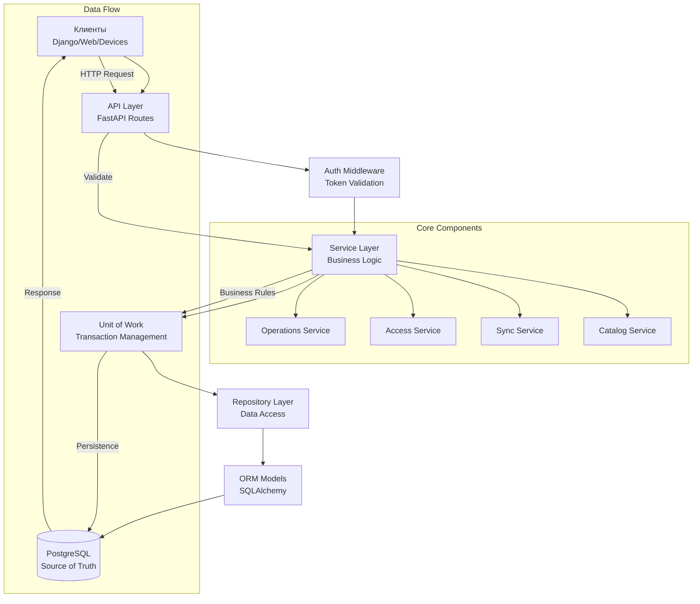

# Анализ проекта SyncServer

## Общая информация
- **Название проекта**: SyncServer
- **Тип**: Backend API для управления складскими данными и синхронизации
- **Технологический стек**: Python, FastAPI, SQLAlchemy 2 async, PostgreSQL, Pydantic v2
- **Архитектура**: Многослойная (API → Services → Repositories → Database)

## Архитектурный анализ

### Ключевые архитектурные решения (ADR)
1. **ADR-0001**: SyncServer как единый источник истины для складских данных
2. **ADR-0002**: Многослойная архитектура с Unit of Work
3. **ADR-0003**: Операционно-ориентированная инвентаризация с производными балансами
4. **ADR-0004**: Токеновая аутентификация и доступ на уровне сайтов
5. **ADR-0005**: Иерархия каталога через adjacency list
6. **ADR-0006**: Идемпотентный прием событий для синхронизации устройств

### Структура проекта
```
SyncServer/
├── app/
│   ├── api/              # HTTP маршруты и зависимости
│   ├── services/         # Бизнес-логика и оркестрация
│   ├── repos/           # Доступ к данным (репозитории)
│   ├── models/          # SQLAlchemy ORM модели
│   ├── schemas/         # Pydantic схемы (DTO)
│   └── core/            # Конфигурация, БД, утилиты
├── db/                  # Миграции и SQL схемы
├── tests/              # Интеграционные и модульные тесты
├── docs/               # Документация и ADR
└── scripts/            # Вспомогательные скрипты
```

## Модели данных

### Основные сущности
1. **User** - пользователи с UUID и токенами
2. **Site** - складские площадки (сайты)
3. **UserAccessScope** - права доступа на уровне сайтов
4. **Device** - зарегистрированные устройства для синхронизации
5. **Category/Item/Unit** - каталог товаров
6. **Operation/OperationLine** - складские операции
7. **Balance** - производные балансы инвентаря
8. **Event** - события синхронизации устройств

### Ключевые особенности моделей
- Балансы вычисляются из операций, не редактируются напрямую
- Каталог глобальный, не привязан к сайтам
- Операции имеют жизненный цикл (draft → submitted → cancelled)
- События синхронизации идемпотентны и упорядочены

## Сервисный слой

### Основные сервисы
1. **OperationsService** - управление складскими операциями
2. **AccessService** - контроль доступа и прав
3. **CatalogAdminService** - администрирование каталога
4. **SyncService** - синхронизация с устройствами
5. **EventIngest** - обработка входящих событий
6. **IdentityService** - управление идентификацией

### Паттерны проектирования
- **Unit of Work** для управления транзакциями
- **Repository** для изоляции доступа к данным
- **Dependency Injection** через FastAPI Depends
- **Strict validation** на уровне сервисов

## API Endpoints

### Основные группы API
1. **Auth** (`/api/v1/auth/*`) - аутентификация и контекст
2. **Admin** (`/api/v1/admin/*`) - управление пользователями, сайтами, устройствами
3. **Catalog** (`/api/v1/catalog/*`) - чтение каталога
4. **Catalog Admin** (`/api/v1/catalog/admin/*`) - изменение каталога
5. **Operations** (`/api/v1/operations/*`) - управление операциями
6. **Balances** (`/api/v1/balances/*`) - просмотр балансов
7. **Reports** (`/api/v1/reports/*`) - отчеты и аналитика
8. **Sync** (`/api/v1/sync/*`) - синхронизация устройств
9. **Health** (`/api/v1/health/*`) - мониторинг

### Аутентификация
- `X-User-Token` для пользователей
- `X-Device-Token` для устройств
- Ролевая модель: root, chief_storekeeper, storekeeper, observer

## Конфигурация и окружение

### Ключевые настройки
```env
DATABASE_URL=postgresql+asyncpg://...
APP_ENV=dev/prod
LOG_LEVEL=INFO
ALLOWED_ORIGINS=
MAX_PUSH_EVENTS=500
DEFAULT_PULL_LIMIT=200
```

### Зависимости
- FastAPI 0.135.1 + Starlette
- SQLAlchemy 2.0.47 + asyncpg
- Pydantic 2.12.5 + pydantic-settings
- Alembic для миграций
- pytest + pytest-asyncio для тестирования

## Тестовое покрытие

### Структура тестов
- **Интеграционные тесты** с изоляцией схем БД
- **Тесты репозиториев** для проверки доступа к данным
- **Тесты сервисов** для бизнес-логики
- **Тесты API** для проверки endpoints

### Ключевые тестовые файлы
- `test_operations_service_cancel.py` - тестирование отмены операций
- `test_auth_routes.py` - тестирование аутентификации
- `test_balances_read_model.py` - тестирование балансов
- `test_catalog_csv_import.py` - тестирование импорта каталога
- `test_http_sync.py` - тестирование синхронизации

## Диаграмма архитектуры



## Анализ состояния проекта

### Сильные стороны
1. **Четкая архитектура** - соблюдение принципов многослойной архитектуры
2. **Хорошая документация** - ADR, API документация, архитектурные схемы
3. **Качественное тестирование** - изолированные тесты с чистыми схемами
4. **Современный стек** - async/await, SQLAlchemy 2, Pydantic v2
5. **Идемпотентность** - важная для синхронизации устройств

### Области для улучшения
1. **Мониторинг** - отсутствие метрик и логов производительности
2. **Кэширование** - нет стратегии кэширования для часто читаемых данных
3. **Миграции данных** - только Alembic для схемы, нет инструментов для миграций данных
4. **Конфигурация** - можно добавить валидацию конфигурации при запуске
5. **Документация API** - можно улучшить OpenAPI спецификацию

### Рекомендации
1. **Добавить health checks** с проверкой зависимостей
2. **Реализовать кэширование** для каталога и балансов
3. **Добавить метрики** для мониторинга производительности
4. **Улучшить логирование** структурированными логами
5. **Создать CI/CD** пайплайн для автоматического тестирования

## Заключение
SyncServer представляет собой хорошо спроектированный backend для управления складскими данными с четкой архитектурой, хорошим тестовым покрытием и современным технологическим стеком. Проект готов к использованию в production, но может быть улучшен за счет добавления мониторинга, кэширования и автоматизации развертывания.
