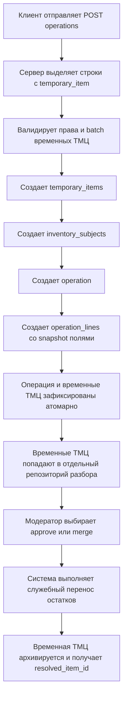

# приступай к ра Техническое задание: система временных ТМЦ

## 1. Цель

Реализовать в SyncServer контур временных ТМЦ, который позволит пользователю создавать недостающие ТМЦ прямо в момент создания операции, не добавляя их сразу в основной каталог.

Система должна поддерживать сценарий, когда в одной операции одновременно присутствуют:
- уже существующие каталожные ТМЦ;
- новые временные ТМЦ, которых ещё нет в каталоге.

После создания операции временные ТМЦ должны попадать в отдельный репозиторий на разбор. По каждой временной ТМЦ допускаются только два финальных решения:
- утверждение как новой постоянной ТМЦ;
- слияние с уже существующей постоянной ТМЦ.

История операций не должна переписываться задним числом.

---

## 2. Бизнес-контекст

### 2.1. Проблема

Сейчас обычный кладовщик не может провести операцию, если нужной ТМЦ нет в справочнике. Это блокирует приёмку и заставляет либо ждать главного кладовщика, либо искать неточное соответствие в каталоге.

### 2.2. Целевой сценарий

1. Пользователь создаёт операцию.
2. В строках операции часть позиций выбирается из текущего каталога.
3. Для отсутствующих позиций пользователь создаёт временные ТМЦ прямо из формы операции.
4. Сервер в рамках одного запроса:
   - создаёт недостающие временные ТМЦ;
   - использует их в строках операции;
   - создаёт саму операцию.
5. После этого временные ТМЦ становятся видны в отдельном контуре разбора.
6. Главный кладовщик или root позже принимает одно из решений:
   - создать на их основе новую постоянную ТМЦ;
   - слить временную ТМЦ с уже существующей постоянной.

### 2.3. Ограничения бизнес-логики

- право создавать временные ТМЦ есть у всех пользователей, кроме `observer`;
- привязка права создания временной ТМЦ к складу не требуется;
- право создать саму операцию остаётся site-scoped и подчиняется текущим правилам доступа;
- временные ТМЦ не должны попадать в основной каталог до решения модератора;
- операция с временной ТМЦ должна быть исторически корректной даже после approve или merge.

---

## 3. Исходные ограничения текущей архитектуры

Текущая модель SyncServer item-centric:

- строки операций ссылаются на каталожную ТМЦ через `operation_lines.item_id`;
- остатки хранятся по паре `site_id + item_id`;
- регистры непринятого, потерянного и выданного имущества тоже завязаны на `item_id`;
- отчёты и списки балансов читают текущее имя ТМЦ через join на таблицу каталожных `items`;
- в строках операций уже сохраняются snapshot-поля имени, SKU, единицы и категории.

### Ключевое следствие

Если реализовывать временные ТМЦ отдельной таблицей, но при этом разрешать смешанные строки в одной операции, то текущей ссылки только на `item_id` недостаточно.

Для поддержки отдельной таблицы временных ТМЦ требуется ввести единый слой ссылки на номенклатурный объект, который может указывать либо на постоянную ТМЦ, либо на временную.

---

## 4. Архитектурное решение

### 4.1. Принятое решение

Для реализации системы временных ТМЦ вводятся:

1. отдельная таблица временных ТМЦ `temporary_items`;
2. отдельный универсальный реестр складских ссылок `inventory_subjects`;
3. перевод всех stock-affecting таблиц с `item_id` на `inventory_subject_id`.

### 4.2. Смысл `inventory_subjects`

`inventory_subjects` — это единый идентификатор складской сущности, который может представлять:
- постоянную ТМЦ из каталога;
- временную ТМЦ из отдельного репозитория.

Именно `inventory_subjects` используются в:
- строках операций;
- остатках;
- регистрах pending acceptance;
- регистрах lost assets;
- регистрах issued assets;
- отчётах и read-model проекциях.

### 4.3. Почему не подходит простая схема с двумя nullable-полями

Вариант с парами вида `item_id` + `temporary_item_id` в каждой таблице отвергается по следующим причинам:
- усложняет уникальные ключи и PK;
- резко усложняет joins и агрегаты;
- размножает одинаковую ветвящуюся логику по всем репозиториям;
- ухудшает дальнейшее развитие отчётов и read-model.

`inventory_subjects` — более тяжёлое, но доменно более чистое и расширяемое решение.

---

## 5. Границы первой реализации

### 5.1. Входит в scope

- создание временной ТМЦ внутри `POST /operations`;
- смешанные строки операции: существующие и новые временные ТМЦ в одном запросе;
- отдельные endpoints для списка, просмотра и разбора временных ТМЦ;
- approve временной ТМЦ как новой постоянной ТМЦ;
- merge временной ТМЦ в существующую постоянную ТМЦ;
- перенос остатков из временного контура в постоянный через служебные движения;
- сохранение исторической достоверности старых операций;
- расширение read-моделей, чтобы временные ТМЦ были корректно видны в операциях, балансах и регистрах.

### 5.2. Не входит в scope первой реализации

- микрокатегории и семейства ТМЦ;
- общий физический остаток для нескольких похожих ТМЦ;
- автоматическое перепривязывание старых операций к постоянной ТМЦ;
- редактирование или физическое удаление исторически использованных временных ТМЦ;
- массовое авто-слияние без решения пользователя с правами модератора.

### 5.3. Обязательный бизнес-кейс первой версии

Обязательный поддерживаемый сценарий — создание временной ТМЦ при создании приходной операции.

Архитектура должна не блокировать расширение на другие типы операций, но для первой реализации policy-слой может ограничить inline-создание временных ТМЦ whitelist-ом допустимых `operation_type`.

---

## 6. Изменения доменной модели

## 6.1. Новая сущность `TemporaryItem`

### Назначение

Хранит временную ТМЦ, которая ещё не является частью постоянного каталога.

### Обязательные поля

- `id`
- `name`
- `normalized_name`
- `sku` nullable
- `unit_id`
- `category_id` nullable
- `description` nullable
- `hashtags` nullable
- `status`
- `resolved_item_id` nullable
- `resolution_type` nullable
- `created_by_user_id`
- `resolved_by_user_id` nullable
- `created_at`
- `resolved_at` nullable
- `updated_at`

### Статусы

- `active` — временная ТМЦ создана и доступна для использования;
- `approved_as_item` — по ней создана новая постоянная ТМЦ;
- `merged_to_item` — временная ТМЦ слита в существующую постоянную ТМЦ;
- `archived` — скрыта из активных списков, но сохранена для истории.

### Правила

- физическое удаление разрешено только если временная ТМЦ не участвовала ни в одной операции и не имеет остатков;
- если временная ТМЦ участвовала в операции, она становится исторически значимой сущностью и подлежит только архивному жизненному циклу;
- после `approved_as_item` или `merged_to_item` запись больше не может использоваться в новых операциях.

## 6.2. Новая сущность `InventorySubject`

### Назначение

Универсальная складская ссылка, на которую опираются write-model и read-model системы.

### Поля

- `id`
- `subject_type` — `catalog_item` или `temporary_item`
- `item_id` nullable
- `temporary_item_id` nullable
- `created_at`
- `archived_at` nullable

### Инварианты

- заполнено ровно одно из полей `item_id` и `temporary_item_id`;
- одна постоянная ТМЦ имеет ровно один `inventory_subject`;
- одна временная ТМЦ имеет ровно один `inventory_subject`.

## 6.3. Изменения существующих сущностей

Следующие таблицы должны быть переведены на `inventory_subject_id`:

- `operation_lines`
- `balances`
- `pending_acceptance_balances`
- `lost_asset_balances`
- `issued_asset_balances`

Для этапа миграции допустимо временно держать legacy-поля `item_id`, но целевая модель должна работать через `inventory_subject_id`.

---

## 7. Контракт создания операции

## 7.1. Общий принцип

Существующий endpoint создания операции сохраняется, но расширяется.

Сервер должен принимать строки, где в каждой строке указан либо существующий `item_id`, либо объект временной ТМЦ на создание.

### Требование совместимости

Старые клиенты, которые передают только `item_id`, должны продолжать работать без изменений.

## 7.2. Новый контракт строки операции

Для каждой строки операции требуется правило XOR:

- либо передан `item_id`;
- либо передан `temporary_item`.

Одновременная передача обоих полей запрещена.

Отсутствие обоих полей запрещено.

### Предлагаемая форма payload

```json
{
  "line_number": 1,
  "qty": 5,
  "batch": null,
  "comment": null,
  "item_id": null,
  "temporary_item": {
    "client_key": "tmp-1",
    "name": "Кабель USB 1м",
    "sku": null,
    "unit_id": 1,
    "category_id": null,
    "description": "Создано из операции",
    "hashtags": ["кабель", "usb"]
  }
}
```

### Назначение `client_key`

`client_key` обязателен для временной ТМЦ в рамках одного запроса и нужен для:
- дедупликации одинаковой временной ТМЦ в нескольких строках одной операции;
- понятного сопоставления ошибок валидации;
- защиты от повторного создания одной и той же временной ТМЦ внутри одного request body.

## 7.3. Поведение сервера при `POST /operations`

Сервер должен действовать атомарно в одной транзакции:

1. Валидировать право пользователя на создание операции по текущим site-rules.
2. Проверить право пользователя на создание временных ТМЦ:
   - разрешено всем, кроме `observer`.
3. Извлечь из строк уникальный batch временных ТМЦ по `client_key`.
4. Провалидировать batch временных ТМЦ.
5. Создать записи в `temporary_items`.
6. Создать соответствующие `inventory_subjects`.
7. Создать операцию.
8. Создать строки операции, где каждая строка ссылается на нужный `inventory_subject`.
9. Заполнить snapshot-поля по состоянию объекта на момент создания строки.
10. При любой ошибке откатить и создание временных ТМЦ, и создание операции.

## 7.4. Идемпотентность

Для защиты от повторного нажатия кнопки создания операции необходимо ввести request-level idempotency key.

### Обязательное требование

`POST /operations`, содержащий хотя бы одну `temporary_item`, должен принимать `client_request_id` или эквивалентный уникальный ключ запроса.

При повторной отправке того же `client_request_id` сервер обязан либо:
- вернуть уже созданную операцию;
- либо вернуть конфликт идемпотентности с понятной диагностикой.

Без этой защиты риск дублей временных ТМЦ и дублей операций считается неприемлемым.

---

## 8. Snapshot-правила и историчность

## 8.1. Базовое правило

В момент создания строки операции сервер обязан сохранять snapshot-значения для обеих разновидностей номенклатуры:
- постоянной ТМЦ;
- временной ТМЦ.

Минимальный состав snapshot-полей:

- `item_name_snapshot`
- `item_sku_snapshot`
- `unit_name_snapshot`
- `unit_symbol_snapshot`
- `category_name_snapshot`

## 8.2. Правило отображения операции

После approve или merge старая операция должна отображаться так:

- основное имя строки — из snapshot-полей на момент операции;
- текущий статус объекта — из актуальной сущности;
- при merge дополнительно показывается ссылка, в какую постоянную ТМЦ была слита временная.

История операции не переписывается.

## 8.3. Требования к API ответа операции

`OperationLineResponse` должен быть расширен как минимум следующими полями:

- `inventory_subject_id`
- `subject_type`
- `item_id` nullable
- `temporary_item_id` nullable
- `item_name_snapshot`
- `item_sku_snapshot`
- `unit_name_snapshot`
- `unit_symbol_snapshot`
- `category_name_snapshot`
- `resolved_item_id` nullable
- `resolved_item_name` nullable

Это необходимо, чтобы UI не строил отображение строк только через текущий каталог.

---

## 9. Правила жизненного цикла временной ТМЦ

## 9.1. Решение `approve as item`

### Смысл

Временная ТМЦ признана новой самостоятельной постоянной ТМЦ.

### Действия системы

1. Создать новую запись в `items`.
2. Создать `inventory_subject` для новой постоянной ТМЦ.
3. Перенести текущие остатки со временной ТМЦ на новую постоянную.
4. Привязать `temporary_items.resolved_item_id` к новой `items.id`.
5. Присвоить временной ТМЦ статус `approved_as_item`.
6. Исключить её из дальнейшего выбора в новых операциях.

## 9.2. Решение `merge to existing item`

### Смысл

Временная ТМЦ признана дублем уже существующей постоянной ТМЦ.

### Действия системы

1. Выбрать целевую постоянную ТМЦ.
2. Перенести текущие остатки со временной ТМЦ на существующую постоянную.
3. Привязать `temporary_items.resolved_item_id` к целевой `items.id`.
4. Присвоить временной ТМЦ статус `merged_to_item`.
5. Исключить её из дальнейшего выбора.

## 9.3. Критическое правило

Ни approve, ни merge не должны перепривязывать старые строки операций к постоянной ТМЦ.

Переносится только текущий остаток и активные проекции, но не историческая ссылка в старых операциях.

---

## 10. Перенос остатков при approve и merge

## 10.1. Базовый принцип

Согласно принятой модели системы, операции являются write-model, а остатки — производной проекцией.

Поэтому перенос остатка между временной и постоянной ТМЦ должен выполняться не прямым апдейтом `balances`, а служебными движениями, которые затем корректно изменяют проекции.

## 10.2. Принятое решение для V1

Для approve и merge система создаёт пару внутренних служебных операций на каждый затронутый склад с ненулевым остатком:

1. служебное списание со временной ТМЦ;
2. служебный приход на постоянную ТМЦ.

Обе операции:
- создаются в одной транзакции резолюции;
- содержат служебную пометку resolution batch;
- не доступны для ручного редактирования пользователем;
- логически связываются с act-ом approve или merge.

## 10.3. Почему не прямой update остатков

Прямое изменение `balances` без операции запрещено, потому что:
- нарушает доменную модель source of truth;
- делает аудит непрозрачным;
- ломает воспроизводимость состояния по журналу движений.

## 10.4. Что переносится

В рамках первой реализации обязательно переносится:
- текущий остаток по складам.

Если временная ТМЦ участвовала в регистрах `pending`, `lost`, `issued`, то резолюция обязана либо:
- запрещаться до очистки этих регистров;
- либо включать отдельную поддержанную логику переноса для каждого регистра.

Для первой реализации рекомендуется выбрать жёсткое правило:

### Правило V1

approve и merge разрешены только если по временной ТМЦ отсутствуют записи в `pending`, `lost` и `issued` регистрах.

Это сильно упрощает безопасную первую поставку и не мешает расширить логику позже.

---

## 11. Отдельный контур endpoint-ов временных ТМЦ

## 11.1. Список endpoint-ов

### 1. `GET /temporary-items`

Назначение:
- список временных ТМЦ для репозитория разбора.

Минимальные фильтры:
- `status`
- `search`
- `created_by_user_id`
- `resolved_item_id`
- `created_after`
- `created_before`
- `page`
- `page_size`

### 2. `GET /temporary-items/{temporary_item_id}`

Назначение:
- карточка временной ТМЦ;
- статус;
- данные для модерации;
- текущая связь с постоянной ТМЦ, если она уже разрешена.

### 3. `GET /temporary-items/{temporary_item_id}/operations`

Назначение:
- история операций по данной временной ТМЦ.

### 4. `POST /temporary-items/{temporary_item_id}/approve-as-item`

Назначение:
- создать новую постоянную ТМЦ на основе временной.

### 5. `POST /temporary-items/{temporary_item_id}/merge`

Назначение:
- слить временную ТМЦ с существующей постоянной.

Payload:
- `target_item_id`
- `comment` optional

## 11.2. Опциональные endpoint-ы второй очереди

- `GET /temporary-items/{temporary_item_id}/similar-items`
- `GET /temporary-items/{temporary_item_id}/balances`
- `GET /temporary-items/{temporary_item_id}/resolution-log`

---

## 12. Права доступа

## 12.1. Создание временной ТМЦ

Разрешено:
- `root`
- `chief_storekeeper`
- `storekeeper`

Запрещено:
- `observer`

Проверка site-scope для самого права создать временную ТМЦ не выполняется.

## 12.2. Создание операции с временной ТМЦ

Для создания операции должны одновременно выполняться два условия:

1. пользователь имеет право создавать временные ТМЦ;
2. пользователь имеет право создать саму операцию на соответствующем складе по текущим policy-правилам.

## 12.3. Разбор временной ТМЦ

Approve и merge разрешены только пользователям с правом управления постоянным каталогом.

Для первой реализации принимается правило:
- `root`
- `chief_storekeeper`

Если позднее потребуется делегировать разбор по site-scope, это оформляется отдельной задачей.

---

## 13. Требования к read-model и отчётам

После введения временных ТМЦ read-модели больше не могут опираться только на `items`.

## 13.1. Балансы

Список балансов должен возвращать:
- `inventory_subject_id`
- `subject_type`
- `item_id` nullable
- `temporary_item_id` nullable
- `display_name`
- `resolved_item_id` nullable
- `qty`

## 13.2. Движение ТМЦ

Отчёт движения должен агрегировать по `inventory_subject_id`, а не только по `item_id`.

Дополнительно должен быть предусмотрен отдельный режим будущего расширения:
- история по конкретной сущности;
- сводная история по постоянной ТМЦ с учётом слитых временных.

Во второй режим первая реализация не обязана входить, но модель данных не должна его блокировать.

## 13.3. Регистры pending, lost, issued

Все регистры, где раньше возвращалось только `item_id`, должны уметь отдавать:
- `inventory_subject_id`
- `subject_type`
- `item_id` nullable
- `temporary_item_id` nullable
- отображаемое имя.

---

## 14. Миграционная стратегия

Реализация требует не только добавления новых таблиц, но и конвертации существующей item-centric модели.

## 14.1. Шаг 1. Создать новые таблицы

- `temporary_items`
- `inventory_subjects`

## 14.2. Шаг 2. Backfill для текущего каталога

Для каждой существующей `items` записи создать одну запись в `inventory_subjects` с типом `catalog_item`.

## 14.3. Шаг 3. Добавить `inventory_subject_id` в текущие таблицы

- `operation_lines`
- `balances`
- `pending_acceptance_balances`
- `lost_asset_balances`
- `issued_asset_balances`

## 14.4. Шаг 4. Заполнить `inventory_subject_id` по текущему `item_id`

Выполнить backfill для всех исторических записей.

## 14.5. Шаг 5. Перевести сервисный код и репозитории

Все write/read операции должны работать через `inventory_subject_id`.

## 14.6. Шаг 6. Сохранить переходную совместимость

На время перехода API может продолжать отдавать `item_id`, если строка относится к постоянной ТМЦ, но внутренней опорной ссылкой уже должен считаться `inventory_subject_id`.

## 14.7. Шаг 7. Удалить legacy-зависимость от `item_id`

После перевода кода и тестов legacy-колонки и ветки логики переводятся в deprecated-режим и затем удаляются отдельной миграцией.

---

## 15. Диаграмма потока



---

## 16. Критерии приёмки

Система считается реализованной корректно, если выполняются все условия ниже.

### 16.1. Создание операции

- существующий `POST /operations` принимает строки с `item_id` и строки с `temporary_item` в одном запросе;
- сервер создаёт временные ТМЦ и операцию атомарно;
- при ошибке не остаётся частично созданных временных ТМЦ без операции;
- старые клиенты с payload только на `item_id` продолжают работать.

### 16.2. Права

- `observer` получает отказ при попытке inline-создания временной ТМЦ;
- остальные роли могут создавать временные ТМЦ при наличии права на создание самой операции;
- approve и merge доступны только модераторам каталога.

### 16.3. Жизненный цикл

- временная ТМЦ не видна в основном каталоге;
- временная ТМЦ видна в отдельном репозитории временных ТМЦ;
- approve создаёт новую постоянную ТМЦ и архивирует временную;
- merge связывает временную ТМЦ с существующей постоянной и архивирует временную.

### 16.4. История

- старая операция после approve или merge продолжает отображать snapshot-имя на момент создания;
- операция дополнительно может показывать resolved target, но не переписывает историческое имя;
- read-model и отчёты не теряют строки по временным ТМЦ.

### 16.5. Остатки

- перенос остатка происходит только через служебные движения;
- прямой update остатков вне operation-driven механизма не используется;
- после approve или merge остатки по временной ТМЦ становятся нулевыми, а остатки по целевой постоянной ТМЦ возрастают на ту же величину.

---

## 17. План реализации

- [ ] Спроектировать и согласовать новые сущности `temporary_items` и `inventory_subjects`
- [ ] Подготовить миграции БД для новых таблиц и новых ссылок `inventory_subject_id`
- [ ] Выполнить backfill `inventory_subjects` для всех существующих `items`
- [ ] Перевести `operation_lines`, `balances` и asset-регистры на `inventory_subject_id`
- [ ] Расширить schema request для `POST /operations` поддержкой `temporary_item`
- [ ] Реализовать transaction-safe создание batch временных ТМЦ внутри `POST /operations`
- [ ] Добавить request-level idempotency для операций с inline temporary items
- [ ] Расширить snapshot-логику для строк операций с временными ТМЦ
- [ ] Расширить response DTO операций, балансов, отчётов и регистров новым типом ссылки
- [ ] Реализовать endpoints `GET /temporary-items` и `GET /temporary-items/{id}`
- [ ] Реализовать endpoints `POST /temporary-items/{id}/approve-as-item` и `POST /temporary-items/{id}/merge`
- [ ] Реализовать служебный перенос остатков через внутренние операции
- [ ] Запретить approve и merge при наличии активных `pending`, `lost`, `issued` записей для V1
- [ ] Добавить тесты миграции, прав, атомарности, approve, merge и отображения истории
- [ ] Обновить API-документацию, domain model и архитектурные документы

---

## 18. Основные риски

### Риск 1. Недооценка масштаба refactor-а

Реализация отдельной таблицы временных ТМЦ при смешанных строках в одной операции требует не локальной доработки, а изменения базовой ссылки write-model.

### Риск 2. Дубли при повторной отправке запроса

Без `client_request_id` могут возникать дубли и временных ТМЦ, и самих операций.

### Риск 3. Потеря историчности в UI

Если фронт продолжит отображать строки только по текущему каталогу, то после merge пользователь увидит неисторическое имя.

### Риск 4. Неполная поддержка read-моделей

Если перевести только операции, но не перевести балансы и регистры, система потеряет консистентность представлений.

### Риск 5. Сложность разрешения активных регистров

Если временная ТМЦ уже участвует в `pending`, `lost` или `issued`, merge и approve становятся существенно сложнее. Для V1 это должно быть жёстко ограничено policy-правилом.

---

## 19. Итоговое решение для согласования

Для реализации системы временных ТМЦ в SyncServer принимается следующая целевая модель:

- временные ТМЦ хранятся в отдельной таблице;
- пользователь создаёт их прямо из `POST /operations`;
- строки операции могут содержать как существующие каталожные ТМЦ, так и новые временные;
- для этого система переходит с `item_id` на универсальный `inventory_subject_id`;
- временные ТМЦ не попадают в основной каталог до решения модератора;
- у временной ТМЦ есть только два финальных исхода: `approve as item` или `merge to existing item`;
- история операций не перепривязывается задним числом;
- перенос текущих остатков выполняется только через служебные внутренние движения.
