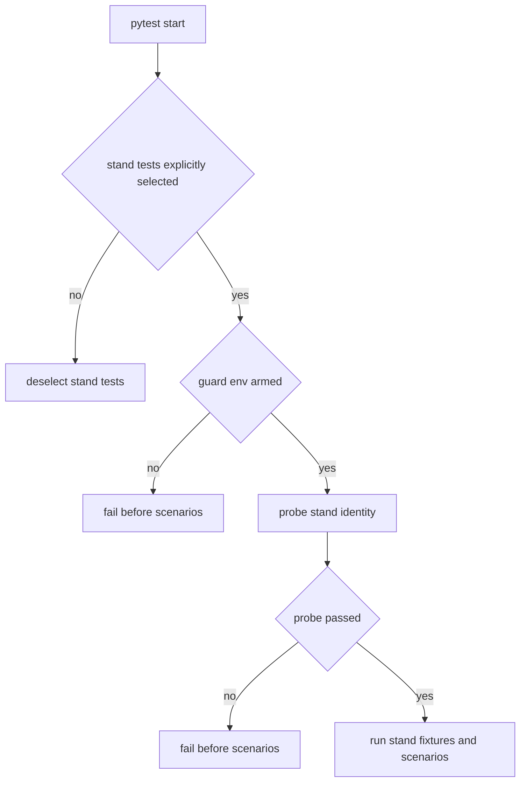

# SyncServer test-stand-only testing strategy

## Краткое резюме проблемы

Текущая тестовая модель опирается на локальную изоляцию через отдельную схему БД на каждый тест в `tests/conftest.py`, создаёт таблицы через ORM metadata и запускает API-тесты против in-process приложения через `ASGITransport`. Это даёт три системные проблемы:

1. Тесты медленные из-за постоянных `create_all` и `drop_all`.
2. Тесты проверяют не тот режим, который будет использоваться целевым пользователем: вместо внешнего поднятого стенда используется синтетическая локальная среда.
3. В текущем наборе смешаны разные уровни тестов: pure unit, repo/db, in-process API, частично сломанные fixture-based сценарии и smoke-паттерны без явной таксономии.

Дополнительно наблюдается архитектурный drift:

- верхнеуровневый `pytest`-слой не разделяет test tiers;
- отсутствуют явные guard-механизмы запуска;
- значимая часть API-тестов создаёт приложение через `create_app(enable_startup_migrations=False)` и therefore bypasses реальный startup path;
- часть тестов зависит от фикстур типа `uow`, `test_site`, `test_user`, `test_operation_with_lines`, но их канонический источник не просматривается в общем test bootstrap, что уже проявляется setup-ошибками в текущем прогоне.

## Анализ текущей архитектуры

### Что есть сейчас

- `tests/conftest.py` берёт `DATABASE_URL_TEST` или fallback на `DATABASE_URL`.
- Для каждого теста создаётся новая схема вида `test_sync_<suffix>`.
- Таблицы создаются через ORM metadata, а не через уже поднятый и мигрированный стенд.
- После теста происходит `drop_all` и удаление схемы.
- Большая часть API-тестов использует dependency override для `get_db` и ходит в приложение через `ASGITransport`, а не по реальному HTTP в поднятый сервер.
- В `pytest.ini` нет маркеров и нет встроенной модели разделения локальных и стендовых тестов.

### Архитектурный вывод

Текущая система по сути является hybrid local integration harness, а не stand-oriented testing. Её нужно разделить на два принципиально разных класса:

1. **offline or unit** — быстрые локальные тесты без реального сервера и без реальной выделенной БД;
2. **stand** — интеграционные и e2e сценарии, которые работают только против вручную поднятого тестового стенда.

## Целевая архитектура тестов

### Главный принцип

Stand-тесты не должны создавать приложение, запускать миграции, создавать схемы, вызывать `Base.metadata.create_all`, использовать `ASGITransport` или локально подменять `get_db`. Они должны работать только через уже поднятый сервер и по минимально необходимому внешнему контракту стенда.

### Рекомендуемая модель слоёв

```text
tests/
  unit/
    ...
  stand/
    conftest.py
    smoke/
    integration/
    e2e/
    support/
  conftest.py
```

### Семантика слоёв

- `tests/unit/`
  - pure unit and offline tests;
  - без реального HTTP;
  - без реальной выделенной БД;
  - допускаются mocks, fakes, in-memory builders.

- `tests/stand/smoke/`
  - минимальная проверка доступности поднятого стенда;
  - базовая аутентификация;
  - health and readiness;
  - пара критичных read-only and low-risk write сценариев.

- `tests/stand/integration/`
  - API и бизнес-потоки через реальный HTTP;
  - работа с заранее известным root token или stand users;
  - создание тестовых данных через API или через очень ограниченный stand bootstrap contract.

- `tests/stand/e2e/`
  - длинные workflow-сценарии;
  - multi-step business flows;
  - потенциально destructive или serial наборы.

## Guard-условия запуска

### Базовое правило запуска

Обычный `pytest` не должен запускать stand-тесты. Они должны быть автоматически `deselect` или `skip` до начала сценариев. Для явно выбранных stand-тестов должен действовать жёсткий fail-fast guard.

### Явные флаги допуска к stand run

Рекомендуемый минимальный набор переменных окружения:

- `SYNC_TEST_MODE=stand`
- `SYNC_TEST_ALLOW_STAND=1`
- `SYNC_TEST_BASE_URL=http://host:port`
- `SYNC_TEST_ROOT_TOKEN=<token>`

Опционально, если часть сценариев требует прямой доступ к БД:

- `SYNC_TEST_DB_URL=<dsn>`
- `SYNC_TEST_ALLOW_DIRECT_DB=1`

### Правила принятия решения

1. Если stand-тесты **не были явно выбраны**, они автоматически убираются из запуска через `deselect`.
2. Если stand-тесты **были явно выбраны**, но `SYNC_TEST_MODE` и `SYNC_TEST_ALLOW_STAND` не заданы корректно, pytest должен завершаться понятной ошибкой ещё на этапе collection or session bootstrap.
3. Если stand-тесты явно выбраны и guard env задан, должен запускаться preflight probe стенда.
4. Если preflight probe не прошёл, pytest должен завершаться до старта первого тестового сценария.
5. Если выбран direct-db слой без отдельного разрешения, запуск должен жёстко блокироваться.

### Рекомендуемая логика guard chain



### Почему именно такая модель

Эта схема соответствует желаемому поведению пользователя:

- по умолчанию стендовые тесты не мешают локальной разработке;
- при явном запуске без подтверждённого стенда получается жёсткий и понятный отказ;
- риск случайного выполнения против неверной среды снижается не одним флагом, а цепочкой проверок.

## Безопасность против случайного запуска не в том окружении

Нужен **multi-factor guard**, а не один env flag.

### Рекомендуемые уровни защиты

1. **Явный selection gate**
   - stand-тесты запускаются только если пользователь сам выбрал `stand`, `integration` или `e2e` слой.

2. **Явный env arm gate**
   - обязательная пара `SYNC_TEST_MODE=stand` и `SYNC_TEST_ALLOW_STAND=1`.

3. **Base URL gate**
   - base URL обязателен и не должен silently default to app-in-process.

4. **Stand identity probe**
   - тесты должны проверить, что сервер подтверждает свою принадлежность к тестовому стенду.

5. **Optional DB fingerprint gate**
   - если используется direct DB, дополнительно проверяется, что DSN указывает на разрешённый тестовый database target.

### Минимальный контракт тестового стенда

Минимальный канонический контракт должен включать:

1. Поднятый HTTP сервер SyncServer.
2. Поднятую и заранее мигрированную БД.
3. Тестовую идентичность стенда, подтверждаемую внешним API.
4. Root or admin token, предназначенный именно для тестового стенда.
5. Гарантию, что стенд безопасен для записи тестовых данных.

### Как лучше подтверждать идентичность стенда

Рекомендуемый порядок предпочтения:

1. dedicated test support endpoint;
2. расширенный health or root payload с полями test stand identity;
3. дополнительный заголовок ответа, подтверждающий test-only environment;
4. при direct-db сценариях — дополнительный fingerprint БД.

### Что должен проверять preflight probe

- HTTP endpoint доступен;
- сервер возвращает корректную test stand identity;
- приложение находится в разрешённом test env;
- стенд отвечает как минимум по health and readiness;
- при необходимости сервер or DB на ожидаемой версии схемы.

## Рекомендуемая структура pytest

### Маркеры

Рекомендуемый минимальный набор маркеров:

- `unit`
- `stand`
- `integration`
- `e2e`
- `smoke`
- `serial`
- `destructive`
- `requires_reset`
- `stand_db`

### Смысл маркеров

- `unit` — быстрые локальные тесты;
- `stand` — любой тест, требующий внешнего поднятого стенда;
- `integration` — stand-based API and repository integration;
- `e2e` — длинный пользовательский workflow;
- `smoke` — маленький поднабор для быстрой проверки стенда;
- `serial` — нельзя параллелить;
- `destructive` — изменяет состояние агрессивно;
- `requires_reset` — требует заранее сброшенного known baseline;
- `stand_db` — прямое обращение к stand database и therefore отдельный guard.

### Рекомендуемый bootstrap по уровням

#### Top-level `tests/conftest.py`

Должен стать тонким и содержать только:

- регистрацию маркеров;
- collection rules;
- deselect logic для stand тестов по умолчанию;
- fail-fast logic для явно выбранных stand тестов без guard env.

#### `tests/stand/conftest.py`

Должен содержать только stand-specific инфраструктуру:

- `stand_settings` session fixture;
- `stand_probe` session fixture;
- `stand_client` session fixture на реальный base URL;
- auth fixtures на основе stand tokens;
- factories для test data namespacing;
- optional cleanup registry.

#### `tests/unit/conftest.py`

Только локальные fakes, builders и mocks. Никаких реальных DSN, схем и startup migration flows.

## Целевая модель фикстур

### Что нужно убрать из канонического stand path

Из stand path должны исчезнуть следующие паттерны:

- schema-per-test;
- `Base.metadata.create_all`;
- `Base.metadata.drop_all`;
- `create_app(enable_startup_migrations=False)` внутри stand-сценариев;
- `ASGITransport` для stand API tests;
- dependency override для `get_db` в stand tests.

### Что должно появиться вместо этого

- session-level `stand_client` с real HTTP;
- `stand_run_id` для namespacing сущностей;
- `auth_headers_root`, `auth_headers_user`, `auth_headers_device` как чистые stand fixtures;
- API-first data factories;
- узкий слой `stand_db` helpers только там, где HTTP не покрывает критичный инвариант.

### Стратегия изоляции данных без schema-per-test

Так как per-test schema уходит, изоляция должна строиться на одном из двух режимов:

1. **run namespacing**
   - каждый запуск получает уникальный `run_id`;
   - создаваемые сущности имеют префиксы or метаданные этого запуска;
   - cleanup best-effort выполняется по `run_id`.

2. **known baseline suite**
   - оператор заранее поднимает чистый стенд;
   - тесты, требующие baseline, явно помечаются `requires_reset`;
   - такие тесты выполняются ограниченно и обычно serial.

Каноническим должен быть первый режим. Второй допустим только для малого числа сценариев.

## Практический план миграции

### Migration todo

- [ ] Зафиксировать каноническую таксономию `unit` and `stand` как source of truth.
- [ ] Зарегистрировать pytest markers и правила explicit selection.
- [ ] Ввести default deselect для stand tests при обычном `pytest`.
- [ ] Ввести fail-fast guard для явно выбранных stand tests без armed env.
- [ ] Ввести stand preflight probe и минимальный stand contract.
- [ ] Перенести API-тесты с in-process app на real HTTP base URL.
- [ ] Отделить pure unit tests от DB-dependent and stand-dependent tests.
- [ ] Переписать service-level тесты с неявными fixture graphs на unit fakes or на stand scenarios.
- [ ] Сузить direct DB testing до небольшого `stand_db` слоя.
- [ ] Убрать schema-per-test bootstrap из канонического интеграционного пути.

### Приоритет 1

Сначала внедряется инфраструктура выбора и защиты:

1. таксономия слоёв;
2. маркеры;
3. guard chain;
4. stand preflight;
5. документация запуска.

Без этого перенос отдельных тестов будет порождать ещё больший хаос.

### Приоритет 2

Потом мигрируются API-тесты, которые уже по смыслу являются stand-кандидатами:

- auth;
- balances;
- catalog read flows;
- operations API;
- reports;
- sync HTTP;
- user admin flow;
- recipients regression;
- lost assets and inventory consistency.

### Приоритет 3

После этого мигрируются service and repository tests по принципу:

- если тест проверяет бизнес-правило без необходимости реального persistence behavior, он уходит в `unit`;
- если тест проверяет поведение через публичный API, он уходит в `stand/integration`;
- если тест зависит именно от DB-specific invariant, он попадает в узкий слой `stand_db`.

### Приоритет 4

В конце удаляется старый bootstrap-путь с per-test schema и metadata create or drop из канонического интеграционного контура.

## Что сохранить как локальные быстрые тесты

С высокой вероятностью в локальный быстрый слой нужно сохранить:

- pure parsing and transformation tests;
- policy tests;
- access rules с mock or fake UoW;
- health logic, если она проверяется через mocks, а не через реальную БД;
- схемы, DTO validation, helper functions, serializer logic.

Практически это относится прежде всего к паттернам вида:

- tests, использующие `SimpleNamespace`, `AsyncMock`, `MagicMock`;
- unit-level service rules без реального HTTP;
- отдельные части catalog CSV parsing и аналогичной логики.

## Что перенести на стенд

На стенд должны уйти все тесты, которые сейчас имитируют реальную эксплуатацию, но делают это локально:

- in-process API tests через `ASGITransport`;
- сценарии, которые создают приложение через `create_app(enable_startup_migrations=False)`;
- repo or DB tests, если их ценность в реальном поведении PostgreSQL and migrations;
- workflow tests, которые сегодня зависят от настоящих ORM моделей, UoW и side effects.

### Особенно явные stand-кандидаты

- auth flows;
- balances endpoints and read models;
- catalog read and admin flows;
- operations acceptance and effective-at flows;
- sync HTTP;
- reports;
- inventory consistency;
- lost assets;
- user admin flow;
- recipients end-to-end regression.

## Отдельное замечание по сломанным fixture-based тестам

Тесты, завязанные на `uow`, `test_site`, `test_user`, `test_operation_with_lines` и похожие фикстуры, нужно рассматривать как отдельный migration track.

Для них нужен decision split:

1. если это тест бизнес-логики, он должен быть rewritten в deterministic unit style с явными fake dependencies;
2. если это тест HTTP or DB поведения, он должен быть перенесён в stand слой;
3. нельзя оставлять их в промежуточном виде, где тест выглядит как unit, но на деле требует скрытого интеграционного bootstrap.

## Основные риски и компромиссы

### Риск 1: потеря полной изоляции per test

После отказа от schema-per-test абсолютная изоляция ослабевает. Это компенсируется:

- run namespacing;
- careful cleanup;
- `requires_reset` для небольшого числа baseline-sensitive сценариев;
- serial execution для destructive workflows.

### Риск 2: часть старых repo or service тестов станет неуместной

Это ожидаемый и здоровый эффект. Новый design заставит определить, что именно тест проверяет: business rule, HTTP contract или DB invariant.

### Риск 3: усложнение preflight и stand contract

Да, вход в stand suite станет строже. Это оправдано, потому что цена случайного запуска против неверной среды выше, чем цена дополнительного bootstrap guard.

### Риск 4: увеличение требований к тестовым данным

Придётся перейти от implicit empty schema к явному управлению данными. Это компромисс в пользу реалистичности и repeatability на целевом стенде.

## Итоговое решение

Каноническая целевая модель для SyncServer должна быть такой:

1. **default pytest == только локальные unit or offline tests**;
2. **stand tests существуют в отдельном слое и не запускаются по умолчанию**;
3. **явный запуск stand tests без armed env приводит к жёсткому fail-fast**;
4. **явный запуск stand tests с armed env проходит только после preflight проверки тестового стенда**;
5. **stand tests работают через реальный HTTP и минимальный контракт поднятого стенда**;
6. **прямой доступ к БД — отдельный узкий режим с отдельным guard**;
7. **старый schema-per-test bootstrap выводится из канонического интеграционного пути**.

Это решение лучше соответствует целевой эксплуатации, делает поведение тестов предсказуемым и превращает тестовый режим в контролируемый и безопасный stand-only workflow.
